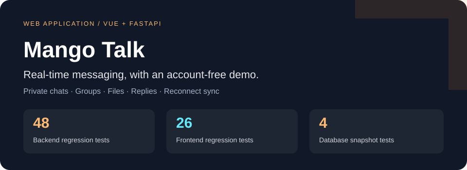
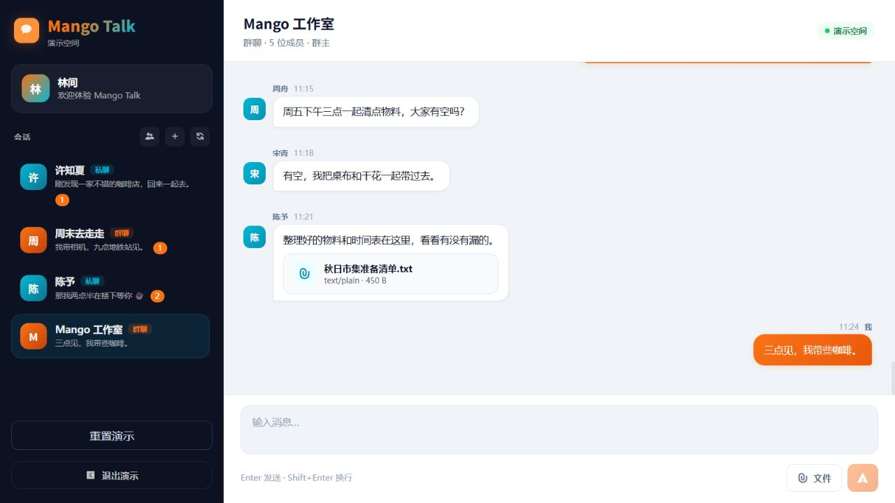
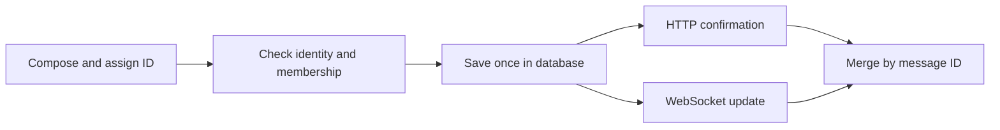
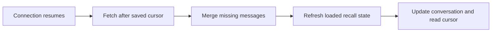

<p align="center"></p>

<p align="center"><b>Private and group chat, with an account-free demo.</b><br>Vue 3 · FastAPI · SQLAlchemy · MySQL · WebSocket</p>
<p align="center"><a href="README.zh-CN.md">简体中文</a> · <a href="https://mango-talk.chenglan.tech/demo">Try the demo</a> · <a href="#run-locally">Run locally</a> · <a href="docs/VALIDATION.md">Validation</a></p>

Mango Talk is a web application for everyday team conversations. It supports private messages, groups, image and file sharing, replies, recalls, and unread counts. The login page opens a complete demo workspace, so visitors can use the interface before creating an account.

## Try a conversation

Open **[the demo workspace](https://mango-talk.chenglan.tech/demo)** to send a message, reply to an earlier one, share a file, or create a conversation. Changes stay in your browser and survive a refresh; reset restores the sample workspace. The demo uses fictional people and conversations, with its own data service and storage.



Registered accounts use the same interface with server-backed conversations. HTTP confirms message submission; WebSocket distributes room and account events. After a connection resumes, the client retrieves missing messages and refreshes recall state.

## Verified behavior

| Check | Result and scope |
| :--- | :--- |
| **48 backend tests passed** | Identity, room permissions, messages, uploads, WebSocket, and legacy migration |
| **26 frontend tests passed** | Sending, input methods, reconnect cursors, message state, and demo isolation |
| **4 snapshot-tool tests passed** | Database connection handling and backup failure paths |
| **1280 × 720 and 390 × 640** | Desktop chat and short-screen dialog checks |
| **Production build passed** | Commit-matched assets and HTTPS release checks |

The test suites use temporary data. These figures describe regression verification, rather than throughput or production usage. Commands, fixtures, and dates are recorded in [Validation](docs/VALIDATION.md).

## Message handling



A stable `client_message_id` follows each send attempt and its retries. A database constraint prevents duplicates within the same sender and room; a changed payload cannot silently reuse an earlier ID. HTTP and WebSocket submissions share the same validation and persistence service.



Replies include a server-provided preview. Opening an older reply retrieves its surrounding messages and fills the intervening history. Pending uploads remain attached to the conversation where they started, and are cancelled on a room switch.

## Design and implementation

- **Shared chat interface:** accounts and the demo use the same Vue views, stores, and components, with transport selected at the API layer.
- **Controlled attachments:** upload records establish ownership; message binding checks the sender and destination. Short-lived download links recheck identity, membership, and recall state.
- **Account lifecycle:** scrypt hashing, unique login identifiers, logout token revocation, and identity checks throughout a WebSocket session.
- **Responsive interaction:** input-method-aware sending, retryable drafts, dialog focus management, reserved image dimensions, and desktop/mobile layouts.
- **Reproducible releases:** each Git commit identifies its build and virtual environment. Deployment runs regression checks, snapshots the database, applies repeatable migrations, and verifies served pages and assets.

[Architecture](docs/ARCHITECTURE.md) connects these decisions to source files. Framework and development-tool acknowledgements are in [THIRD_PARTY.md](THIRD_PARTY.md).

## Run locally

Requires **Python 3.10+** and **Node.js 22.22.2 or 24.15+**. The demo runs with the frontend alone:

```bash
git clone https://github.com/CatAlvin/Mango-Talk.git
cd Mango-Talk/frontend
npm ci
npm run dev
```

Open **[http://127.0.0.1:5173/demo](http://127.0.0.1:5173/demo)**. To use registered accounts, start the backend in another terminal. SQLite provides a self-contained local setup; MySQL 8 is used for deployment.

```bash
cd Mango-Talk/backend
python -m venv .venv
# Activate .venv for your shell, then:
python -m pip install -r requirements-dev.txt
python -c "from shutil import copyfile; copyfile('.env.example', '.env')"
```

Set these values in the new `backend/.env`:

```dotenv
DATABASE_URL=sqlite:///./mango-talk.db
APP_ENV=development
```

Generate a key with `python -c "import secrets; print(secrets.token_urlsafe(48))"` and set `JWT_SECRET_KEY` locally. Then run:

```bash
python -m app.db.migrate
python -m uvicorn app.main:app --host 127.0.0.1 --port 8000
```

Vite proxies API and WebSocket requests to the local backend. Create your own account from the login page. [Environment examples](backend/.env.example) also cover MySQL and upload storage.

## Verify and explore

```bash
# From the root, with the backend virtual environment activated:
python -m pytest -q backend/tests
python -m unittest discover -s deploy -p 'test_*.py' -q
python scripts/check_public_content.py
cd frontend
npm test
npm run build
```

| Start here | What it contains |
| :--- | :--- |
| [`backend/app/services/messages.py`](backend/app/services/messages.py) | Shared validation, deduplication, and serialization |
| [`backend/app/services/uploads.py`](backend/app/services/uploads.py) | Storage containment and download authorization |
| [`frontend/src/composables/`](frontend/src/composables/) | Sending, connections, and dialogs |
| [`frontend/src/lib/demo.js`](frontend/src/lib/demo.js) | Independent, persistent demo data |
| [Architecture](docs/ARCHITECTURE.md) | Data flow and persistence |
| [Validation](docs/VALIDATION.md) | Test commands and browser checks |
| [Deployment](docs/deployment.md) | Release, backup, and recovery |

The deployed service uses one API worker and local attachment storage. Adding multiple instances requires shared event distribution and storage. Deployment destinations are provided through an ignored local configuration or explicit arguments.
