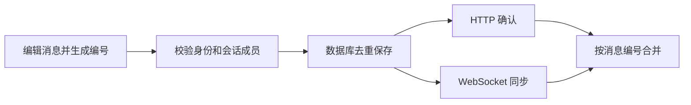
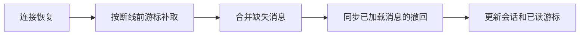

<p align="center"></p>

<p align="center"><b>支持私聊、群聊和附件分享的实时聊天应用。</b><br>Vue 3 · FastAPI · SQLAlchemy · MySQL · WebSocket</p>
<p align="center"><a href="README.md">English</a> · <a href="https://mango-talk.chenglan.tech/demo">体验演示</a> · <a href="#本地运行">本地运行</a> · <a href="docs/VALIDATION.md">验证记录</a></p>

Mango Talk 面向团队日常沟通，提供私聊、群聊、图片与文件、消息回复、撤回及未读提醒。登录页可以直接进入演示空间，观看者无需注册，就能使用完整的聊天界面。

## 从一段对话开始

打开 **[演示空间](https://mango-talk.chenglan.tech/demo)**，可以发送消息、回复早先的对话、分享文件或创建会话。演示使用虚构人物和聊天内容，通过独立数据服务运行；修改保存在当前浏览器，刷新后保留，也可以重置。


真实账号使用相同界面，聊天记录保存在服务端。HTTP 确认发送结果，WebSocket 同步消息、撤回和会话变化；连接恢复后，客户端补取断线期间的消息，并更新已加载消息的撤回状态。

## 已核验的结果

| 检查 | 结果与范围 |
| :--- | :--- |
| **后端 48 项测试通过** | 身份、会话权限、消息、附件、WebSocket 与旧数据库迁移 |
| **前端 26 项测试通过** | 发送、输入法、重连游标、消息状态与演示隔离 |
| **快照工具 4 项测试通过** | 数据库连接解析与备份失败处理 |
| **1280 × 720 / 390 × 640** | 桌面聊天与手机短屏弹窗检查 |
| **生产构建通过** | 构建对应 Git 提交，线上页面与素材比对通过 |

测试使用临时数据。上述数字表示回归验证结果；运行命令、测试场景与日期见[验证记录](docs/VALIDATION.md)。

## 消息如何发送



每次发送使用稳定的 `client_message_id`，重试沿用同一编号。数据库约束防止同一发送者在同一会话中重复入库；如果内容已经改变，服务端不会将其误认为先前的重试。HTTP 和 WebSocket 使用同一消息服务进行校验和保存。



引用回复带有服务端摘要；跳转较早的原消息时，会加载周围记录并补齐中间历史。上传任务绑定发起时的会话，切换会话会取消任务，避免附件发送到其他房间。

## 设计与实现

- **共用聊天界面：** 正式账号与演示使用相同的 Vue 页面、状态和组件，由 API 层选择服务端请求或本地数据服务。
- **附件访问控制：** 上传记录确定所有者，消息绑定校验发送者及目标会话；短期下载链接再次核对身份、成员权限和撤回状态。
- **账号生命周期：** scrypt 密码散列、共享的登录标识唯一约束、退出撤销令牌，以及 WebSocket 会话中的身份复核。
- **桌面与手机交互：** 中文输入法发送、失败重试与草稿保留、弹窗焦点管理、图片尺寸预留和响应式布局。
- **可复现的发布：** 每个 Git 提交对应构建和独立虚拟环境；发布前执行回归、数据库快照与重复迁移，随后核对线上页面及素材。

[架构说明](docs/ARCHITECTURE.md)提供源码入口与数据流，[THIRD_PARTY.md](THIRD_PARTY.md)记录框架和开发工具说明。

## 本地运行

需要 **Python 3.10+**、**Node.js 22.22.2 或 24.15+**。先运行前端即可体验演示：

```bash
git clone https://github.com/CatAlvin/Mango-Talk.git
cd Mango-Talk/frontend
npm ci
npm run dev
```

打开 **[http://127.0.0.1:5173/demo](http://127.0.0.1:5173/demo)**。如需注册并使用真实账号，在另一个终端启动后端。下面使用 SQLite；线上服务使用 MySQL 8。

```bash
cd Mango-Talk/backend
python -m venv .venv
# 激活当前终端对应的虚拟环境后：
python -m pip install -r requirements-dev.txt
python -c "from shutil import copyfile; copyfile('.env.example', '.env')"
```

在新建的 `backend/.env` 中设置：

```dotenv
DATABASE_URL=sqlite:///./mango-talk.db
APP_ENV=development
```

执行 `python -c "import secrets; print(secrets.token_urlsafe(48))"` 生成密钥，在本机填入 `JWT_SECRET_KEY`，随后启动：

```bash
python -m app.db.migrate
python -m uvicorn app.main:app --host 127.0.0.1 --port 8000
```

Vite 将 API 和 WebSocket 代理到本地后端。启动后可从登录页创建自己的账号。[环境示例](backend/.env.example)包含 MySQL 和附件存储设置。

## 验证与源码入口

```bash
# 在仓库根目录执行，先激活后端虚拟环境：
python -m pytest -q backend/tests
python -m unittest discover -s deploy -p 'test_*.py' -q
python scripts/check_public_content.py
cd frontend
npm test
npm run build
```

| 入口 | 内容 |
| :--- | :--- |
| [`backend/app/services/messages.py`](backend/app/services/messages.py) | 统一校验、去重与消息序列化 |
| [`backend/app/services/uploads.py`](backend/app/services/uploads.py) | 存储路径检查与下载授权 |
| [`frontend/src/composables/`](frontend/src/composables/) | 发送、实时连接与弹窗交互 |
| [`frontend/src/lib/demo.js`](frontend/src/lib/demo.js) | 独立、可持久化的演示数据 |
| [架构说明](docs/ARCHITECTURE.md) | 模块、数据流与部署结构 |
| [验证记录](docs/VALIDATION.md) | 测试命令与浏览器检查 |
| [发布与恢复](docs/deployment.md) | 发布、备份及恢复步骤 |

线上服务使用一个 API worker 与本地附件存储。增加多实例时，需要接入共享事件分发和附件存储。部署目标通过忽略的本地配置或命令参数提供。
