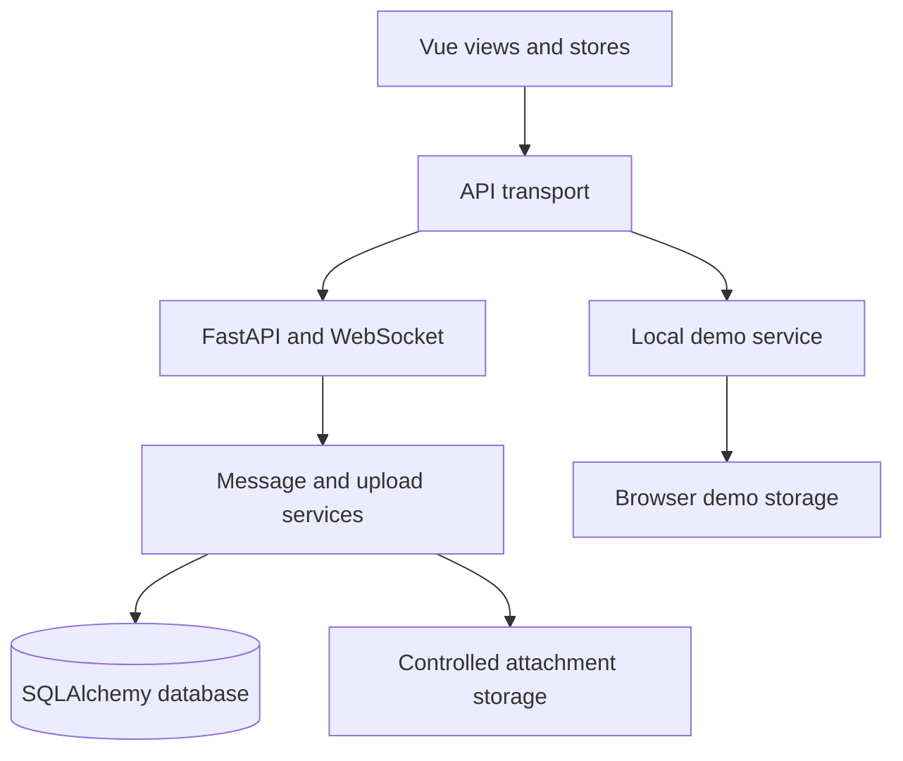

# Architecture

## Application flow

`frontend/src/lib/api.js` selects the backend or demo transport. Demo storage is separate from real login credentials, and demo mode creates no chat API or WebSocket connections. Mode and room changes invalidate earlier asynchronous work so late responses cannot populate a newly selected workspace.

## Messages and history

`backend/app/services/messages.py` serves both submission channels. It checks membership, resolves replies, binds owned uploads, and saves messages. The unique key `(room_id, sender_id, client_message_id)` makes a repeated submission return its original result. Serialization batches users and reply targets, and omits recalled content and attachments.

The first history window contains the newest messages, displayed in ascending ID order. Before/after cursors provide pagination; a context endpoint loads the neighborhood of a reply target. The client fills gaps when combining distant windows. Reconnection uses the cursor captured before opening the socket, then refreshes loaded message IDs to reconcile offline recalls.

`useComposer.js` owns send attempts, draft versions, and upload cancellation. `useRoomSocket.js` handles heartbeat, backoff, connection generations, and recovery. Pinia stores merge HTTP confirmations and live events by message ID.

## Identity and files

Passwords use scrypt. A verified legacy bcrypt password is rehashed during login. Username and phone identifiers share a uniqueness table. Access tokens have expiry, purpose, and revocation state; REST requests and WebSocket actions recheck the active user.

Upload records own server metadata and contained storage paths. Clients send upload IDs rather than filesystem paths. Binding checks ownership and membership. Download tokens are purpose-scoped and valid for ten minutes; downloads also recheck identity, room membership, and recall state. Unsafe active-content types are rejected, and ordinary files are returned as downloads.

## Releases

Nginx serves the frontend and proxies API and WebSocket routes. A dedicated system user runs one Uvicorn worker. Each release has its own source, build, and virtual environment; a current-release link selects the active version. Configuration, uploads, and backups persist outside individual releases.

Deployment locks the operation, verifies the commit, runs checks, snapshots the database, applies repeatable migrations, switches the release, and verifies HTTPS health, the manifest, client routes, and demo assets. Application recovery restores earlier code and configuration while retaining new messages and compatible schema changes.

| Location | Responsibility |
| :--- | :--- |
| `backend/app/api/` | HTTP and WebSocket entry points |
| `backend/app/services/` | Persistence, uploads, and live connections |
| `backend/app/models/` | Users, identities, rooms, read cursors, messages, and uploads |
| `backend/app/db/migrate.py` | Schema upgrade and legacy attachment registration |
| `frontend/src/views/` | Login, registration, and chat |
| `frontend/src/composables/` | Sending, connections, page coordination, and focus |
| `frontend/src/lib/demo.js` | Fictional conversations and browser persistence |
| `deploy/` | Deployment, snapshots, and recovery |

The live connection registry and attachment files belong to one server instance. Shared event distribution and storage are required before adding API instances.
