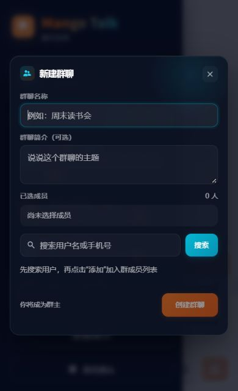

# Validation

Verification date: **9 October 2026**. Backend checks ran on Windows/Python 3.11 and the deployment host/Python 3.10. Frontend checks used Node.js 24.19. Deployment uses MySQL; regression fixtures use independent SQLite databases and temporary attachments.

## Automated checks

| Suite | Result | Covered behavior |
| :--- | ---: | :--- |
| Backend pytest | **48 passed** | Identity, long passwords, revocation, membership, message retries, history, replies, recalls, uploads, live events, and migration |
| Frontend Vitest | **26 passed** | Composition, drafts, retries, upload cancellation, recovery, history, recall state, demo isolation, and views |
| Snapshot unittest | **4 passed** | Connection options, password handling, incomplete backups, and gzip verification |
| Frontend production build | **Passed** | Locked dependencies and Vite build |

The migration test upgrades twice, compares existing columns and timestamps, and preserves legacy accounts, messages, and attachments. Upload checks cover anonymous and nonmember requests, ownership, signed links, recalls, path containment, and rejected file types.

From the root, with the backend virtual environment activated:

```bash
python -m pytest -q backend/tests
python -m unittest discover -s deploy -p 'test_*.py' -q
python scripts/check_public_content.py
cd frontend
npm ci
npm test
npm run build
```

GitHub Actions runs regression suites, public-content checks, and the frontend build. Test counts are collected suite results, rather than a coverage percentage or concurrency measurement.

## Browser checks

- Login, registration entry, and account-free demo entry.
- Sending, replies, recalls, file upload, member search, and conversation creation with isolated accounts.
- Latest history and an early reply in a 126-message fixture, with continuous history after loading.
- Demo send, reply, recall, persistence after refresh, and reset.
- **1280 × 720** desktop and **390 × 640** mobile layouts: dialog scrolling, visible actions, focus, and horizontal overflow.
- Direct navigation and refresh at `/demo` and `/demo/`, including demo resources.

The screenshots use the fictional workspace.


<p align="center"></p>

## Release checks

Deployment confirms database health and the exact commit in `/release.json`. It compares `/`, `/login`, `/register`, `/chat`, `/demo`, and `/demo/` with the built `index.html`, then compares demo resources with their build files. This catches directory redirects and incorrect fallbacks as well as HTTP errors.

Backups and migration checks run before accepting the new application. Production records and attachments are not used as fixtures or published evidence.
